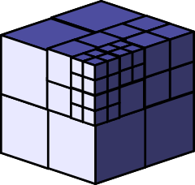
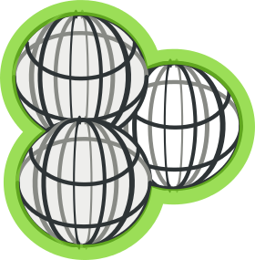
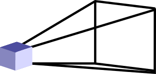

.. role:: cite

.. role:: ref

.. raw:: latex

   \providecommand*\DUrolecite[1]{\cite{#1}}
   \providecommand*\DUroleref[1]{\ref{#1}}

Previous Research Activities
============================

Overview
--------

My first publication in an international venue is a paper I wrote in 2006 when
I was a master student at École Nationale des Arts et Métiers (ENSAM/ParisTech).
It discussed a novel upper ontology for manufacturing processes and how it could
be put in use to automate manufacturing lines. To date, it remains my most cited
paper, with over 80 citations.

Since that time, my research activities have focused on bridging the gap between
artificial intelligence (in particular, semantic techniques) and human-robot
interaction.

Instead of presenting my past research activities in a chronological order (to
be found in my résumé), I propose to organize them into four themes: my research
on *semantic tools for robotics*, their *applications to grounded interaction*,
more general contributions to *cognition for human-robot interaction*, and
finally a focus on my *experimental contributions*.

I then conclude this report on my past research activities with a summary of my
other contributions, from teaching to scientific dissemination, to my involvment
in notable academic software projects.

Semantic tools for robotics
---------------------------

Paris 5?

ENSAM, MASON
:cite:`lemaignan2006mason`, over 80 citations

INRIA, semantic V2V networking, control framework
:cite:`mehani2007networking`

:cite:`Lemaignan2010` ORO

Talk at INNOROBOT2013
:cite:`lemaignan2013explicit`

Semantic tools for grounded interaction
---------------------------------------

PhD LAAS/TUM

:cite:`ros2010which` (ROMAN best paper award)

:cite:`Lemaignan2011` (HRI Pioneers)

Applications to interaction
+++++++++++++++++++++++++++

Interaction with grounded verbal communication.

:cite:`Lemaignan2011a`

:cite:`Ros2010a`
:cite:`lemaignan2011what`
:cite:`lemaignan2011dialogue`
:cite:`lemaignan2013talking`

Joint action,...

full paper
The 'CHRIS' suite
:cite:`Lallee2010b, Lallee2011, Lallee2012`

workshop
:cite:`gharbi2013natural`
:cite:`clodic2013on`

Perspective taking
:cite:`Warnier2012a`

Conducting human-robot experiments
----------------------------------

Table :ref:`experiences` lists the main experiments I have conducted over the
last 4 years.

.. raw:: latex

    \begin{table*}
    \begin{center}

    \begin{tabular}{lll}
    \bf{Experiment} & Focus & Reference \\
    \hline
    {\it Point \& Learn} (2010) & Interactive knowledge acquisition & \cite{Lemaignan2010} \\
    {\it Spy Game} (2010) & Interactive object discrimination & \cite{ros2010which} \\
    {\it Moving to London} (2011) & Multi-modal interaction, perspective taking & \cite{lemaignan2011what} \\
    {\it Roboscopie} (2011) & Theater, reflection on the future of HRI & \cite{lemaignan2012roboscopie} \\
    {\it Cleaning the table} (2011) & Full stack integration & \cite{alami2011when} \\
    {\it I'm in your shoes} (2012) & False beliefs & \cite{Warnier2012a} \\
    {\it Give me this} (2012) & Natural joint object manipulation & \cite{gharbi2013natural} \\
    {\it Aperitif time} (2012) & Multi-modal interaction, perspective taking & \cite{lemaignan2013talking} \\
    {\it CoWriter 1} (2013) & \emph{Child-child experiment}, interaction protocols, field experiment &  \\
    {\it Ranger} (2013) & Child-robot experiment, cognitive projections in HRI &  \\
    \hline

    \end{tabular}
    \end{center}
    \caption{Main experiments conducted in human-robot interaction.}
    \label{experiences}
    \end{table*}

postdoc EPFL

Field experiments
+++++++++++++++++

:cite:`lemaignan2012roboscopie`

postdoc EPFL

Cognition for Interaction
-------------------------

:cite:`alami2011when`
:cite:`Lemaignan2012`
:cite:`lemaignan2014human`

Spatial and Geometric Representation for Robots
+++++++++++++++++++++++++++++++++++++++++++++++

After researching knowledge representation and reasoning on robots for four
years, it was clear that (1) symbolic knowledge in isolation is useless, and
(2) the design and implementation of a versatile representation paradigm for
both the geometric and temporal Umwelt (*self-centered world*) of the robot is
critical and not satisfactorily addressed in the human-robot interaction
community.

During my first post-doc (LAAS-CNRS, 2012/2013), I have designed and prototyped
a novel distributed tool focused on this issue, while keeping in mind
practical technical challenges and actual deployment on robots.

Amongst the features such a representation system was expected to efficiently support, we can mention:

- Representation of continuous/discrete fields (visibility, reachability,...),
- Account for uncertainties,
- Support for the alteration of the perceived environment based on physics,
  semantics or dialogue,
- Support for *moving in time*: remember past situations or imagine future
  ones. Support for action/situation recognition,
- Monitoring at fine temporal resolution (for instance, for back channel
  communication),
- Make it easy to implement algorithms like perspective taking, collision
  detection or inverse kinematics

Named `underworlds`, the software prototype that I developped during my
post-doc, uses a metaphor of *worlds* (pairs of {3D model, timeline}) as
representations of the environment. These *worlds* are produced and used by the
various software modules on the robot to store/reason/query the current state
of the world.

Each of these *worlds* can synchronize with eachother, but can also live and
evolve independantly (think *hypotetical worlds*, well suited for planing of
future actions for instance). Another example: by using to different *worlds*
to support their computations, algorithms with different paces (like relatively
slow 3D motion planning on one hand, and quick visibility check on the other
hand) can co-exist.

========= ================== =========================================
|nodes-1| Mesh               Concrete physical objects, bounding boxes
|nodes-2| Field              Concrete physical objects, bounding boxes
|nodes-3| Group              Concrete physical objects, bounding boxes
|nodes-4| Region of Interest Concrete physical objects, bounding boxes
|nodes-5| Sensor             Concrete physical objects, bounding boxes
========= ================== =========================================

Involvment in the scientific community
--------------------------------------

Student association for Cognitive Sciences
++++++++++++++++++++++++++++++++++++++++++

Vice-chair of InCOGnu, Toulouse local chapter of the national FRESCO Union of Young Reseacher in Cognitive Sciences

Organization of CJCSC

Simulation for robotics
+++++++++++++++++++++++

LAAS, MORSE

:cite:`Echeverria2011`  :cite:`echeverria2012simulating`
:cite:`lemaignan2012morse`

Tutorial at EURON2012
WS MORSE2013
Based on 2012's user survey, MORSE is used in 13 countries, by more than 20
different institutions. In the meantime, MORSE 1.0 has been released, and the
amount of users is likely to be much higher now.

Organization of the first international workshop on MORSE in 2012, with 15 participants from 4 countries.

Involvment in the ROS ecosystem
+++++++++++++++++++++++++++++++

Acknowledged as a major contributor to ROS Electric for the port to Python3,
support of ROS on Nao robot.

Technical background
--------------------

Software development
++++++++++++++++++++

Management of large software projects

Several open-source packages that are used beyond the walls of the original lab
(knowledge base for robotics, natural language processing package, versatile 3D
simulation package). cf GitHub.

:cite:`mallet2010genom3`
:cite:`stinckwich2007squeakbot`

Hand-on experience on several robotic platforms, including PR2, Nao, 1- &
2-hand mobile manipulators.

Teaching
--------

Teaching assistant (*moniteur*) at INSA Toulouse for 3 years: Prolog,
ontologies, advanced Java, ADA, advanced databases.

Several tutorials at both local and international levels, on technical topics
ranging from software development techniques (code versioning, building tools)
and programming (Python) to robotics simulation (including a tutorial during EURON2012 conference, Danemark).

Conclusion
----------

An International Experience
+++++++++++++++++++++++++++

ENSAM/KIT

PSI

World tour

LAAS/TUM

EPFL

.. raw:: latex

   \bibliographystyle{plain}
   \bibliography{biblio}
